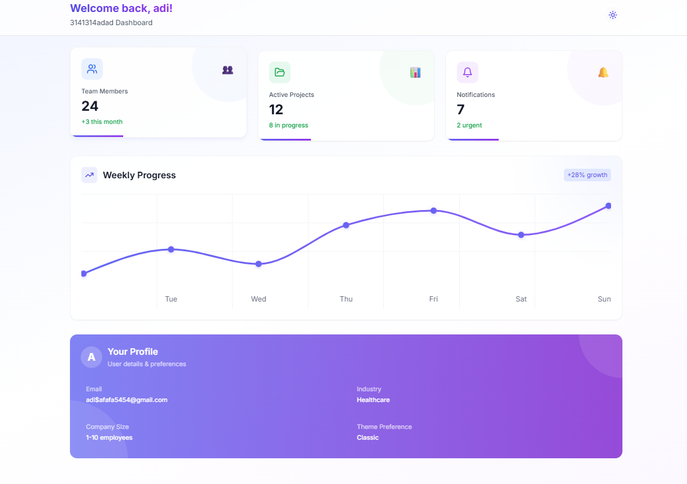

# 🧭 Onboarding & Dashboard Interface

A responsive onboarding wizard and dashboard interface built with **React**, **Tailwind CSS**, and **Framer Motion**.

## 🚀 Features

- ✅ 3-Step Onboarding Wizard:
  - Step 1: Personal Info (Name, Email)
  - Step 2: Business Info (Company Name, Industry, Company Size)
  - Step 3: Preferences (Theme, Layout)
  - Includes Validation and Progress Indicator

- ✅ Dashboard with:
  - Team Members Count
  - Active Projects
  - Notifications
  - Weekly Progress Chart (Recharts)
  - User Profile Summary
  - Dark Mode Toggle
  - Edit Profile (Optional)

- 📦 State management via React Context
- 💾 Data persistence via `localStorage`
- 📱 Fully Responsive + Smooth Transitions

## 🖼️ Screenshots

### ✅ Dashboard

